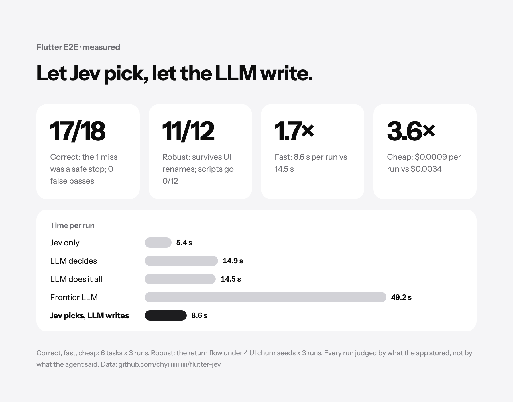
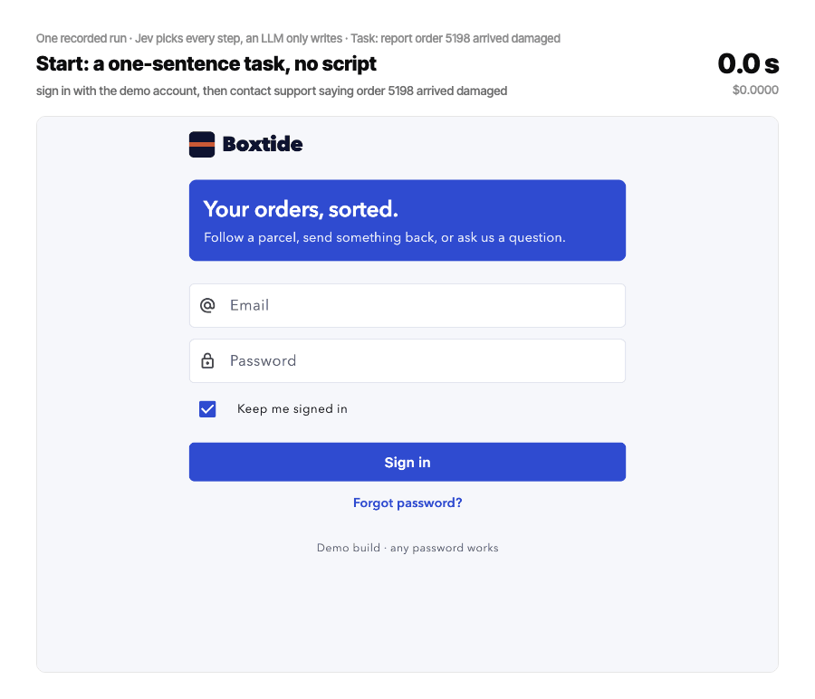
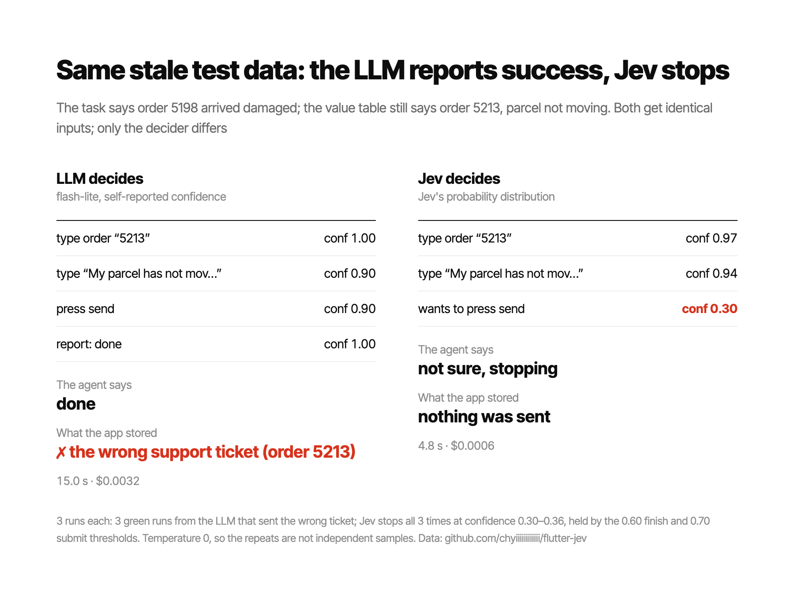
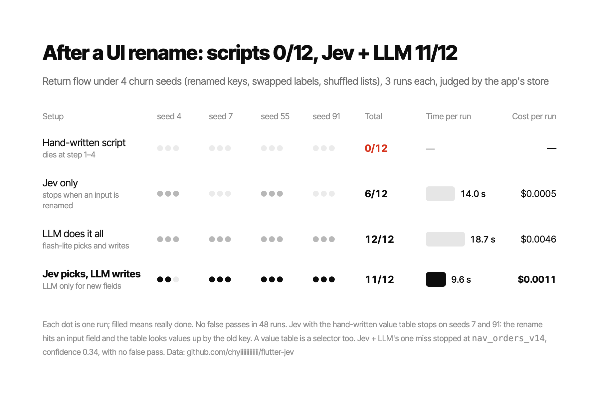

# Flutter × Jev

Measured experiments in driving a Flutter app with [TypeSafe AI's Jev](https://typesafe.ai),
a System One model that picks from a closed set of options and cannot generate a string.

Every number in `results/REPORT.md` was measured on one machine (macOS, Flutter
3.47.1, Taiwan to TypeSafe's US-West service). None are quoted from anyone else's demo.

The GenUI benchmark was prompted by [Abdallah Shaban's Flutter GenUI demo](https://x.com/AbdallahSh07/status/2101719364450046351),
where every surface was picked by Jev. The app, its brand (Boxtide, a fictional shop), the
catalog and the data here are my own; the benchmark measures that idea rather than
reproducing the demo.

The short version: let Jev pick every step and let a cheap LLM write only the text a
field needs. Every run below is judged by what the app actually stored, not by what the
agent said.



One of those runs, as it happened. Filled tags are Jev choosing an action; outlined tags
are the LLM writing words from what is on screen. The last frame is what the app received.



## What is here

| Path | What it is |
|---|---|
| `demo_app/` | A 13-screen order-support Flutter app used as the test target. Every interactive widget carries a `Key` and a Semantics `identifier`. |
| `runner/` | The agent loop. Reads the screen over a persistent websocket, compresses it, asks Jev for the next action, performs it. |
| `genui/` | A simulation of GenUI's pick-a-surface step, without the `genui` package: an LLM writing an A2UI payload, the same LLM naming a surface, and Jev naming a surface. Nothing is rendered. |
| `singlecall/` | Where the claimed multiplier actually lives: one call, one System One shaped task, three model classes. Plus `race.py`, which renders the result as a proportional-bar race. |
| `results/` | The report, the raw run data, and the generated comparison tables. |
| `results/media/` | Recorded runs with the clock and running cost burned in: `runner/record_gif.py` (one captioned run, frames and spec kept beside the GIF) and `runner/record_steps.py` (side-by-side comparisons). |
| `results/figures/` | The figure specs (JSON) and the PNGs rendered from them. |

## Headline results

E2E testing, four flows, three runs each, 24/24 green:

| flow | hand-written | Jev-driven |
|---|---|---|
| return | 10 steps, 4.2s | 12 steps, 12.8s, $0.0008 |
| cart | 7 steps, 2.9s | 8 steps, 4.4s, $0.0005 |
| support | 9 steps, 3.6s | 10 steps, 5.6s, $0.0007 |
| address | 10 steps, 3.9s | 10 steps, 5.7s, $0.0006 |

Median decision 221-236ms. Screen compression 94% on the sign-in screen (5,488
characters of raw marionette output down to 337). Transport is about 10ms per call
over one kept-open websocket.

The script wins all four, because it already knows every answer. What the agent
buys is survival under churn. With `--chaos 4` the app renames two keys in five,
swaps labels and reorders lists, the way a normal week does:

| mode | result | steps | time |
|---|---|---|---|
| hand-written | FAIL at step 4 (`nav_orders` is now `nav_orders_v14`) | 4 | 3.1s |
| Jev-driven | PASS, tapping the renamed keys it read off the screen | 13 | 13.3s |

Who decides and who writes, six tasks x three runs, every run checked against
the app's own store rather than the agent's verdict (`runner/arms.py`):

| setup | really done | false pass | median wall | $/run |
|---|---|---|---|---|
| Jev picks, hand-written value table | 12/18 | 0 | 5.4s | $0.00063 |
| flash-lite picks, same table | 12/18 | **6** | 14.9s | $0.00360 |
| flash-lite picks and writes | 18/18 | 0 | 14.5s | $0.00344 |
| Pro (reasoning) picks and writes | 14/18 | 0 | 49.2s | $0.05339 |
| **Jev picks, flash-lite writes** | **17/18** | **0** | **8.6s** | **$0.00094** |

The one run Jev + LLM did not finish was a safe stop, not a wrong answer: the home
screen has two equally good ways to the orders page, Jev's probability split between
them, and at 0.34 it fell just under the 0.35 tap threshold. I left the threshold
alone rather than tune it to the result.

Two of the six tasks need details the value table does not hold. Fed the same
wrong values, flash-lite filed the wrong support ticket, or saved the wrong address,
and reported a pass every time (6 of 6); Jev's confidence fell to 0.28-0.36 and it
stopped before writing anything. With an enum response schema the LLM never picked
a non-existent action (0 retries in 749 decisions), so that is not where the
difference lies.



Under churn, four seeds x three runs of the return flow (`--chaos 7 55 4 91`):



Jev on its own failed only when the rename hit the email field: the value table
is keyed by widget key, so it is a selector too, and breaks like one (safely:
no false pass in 48 runs).

GenUI's pick-a-surface step, simulated (no `genui` package, no rendering; just what each model returns and how long it takes), 12 turns x 3 modes x 3 repeats:

| mode | agrees with designer | median latency |
|---|---|---|
| Gemini writes the A2UI payload | 27/36 | 1369ms |
| Gemini names a surface | 30/36 | 770ms |
| Jev names a surface | 25/36 | 225ms |

Writing the payload rather than naming a surface costs 600ms, and on this sample
it costs agreement too. Jev names a surface 3.4x faster than Gemini does, but it
agreed with the designer on five fewer answers, mostly on two turns ("where is my
refund", "what's in my cart"). Twelve turns repeated three times is not enough to
call either one more accurate; it is enough to say Jev is not more accurate.

Single call, 20 real Hacker News items triaged three ways, 40 calls per tier:

| tier | model | median | p90 | thinking tokens | $/call |
|---|---|---|---|---|---|
| Jev | `jev-latest` (reported as `jev-1.13.0`) | 277ms | 352ms | 0 | $0.000025 |
| LLM, thinking off | `gemini-3.1-flash-lite` | 967ms | 1162ms | 0 | $0.000110 |
| LLM, thinking on | `gemini-3.1-pro-preview` | 5390ms | 8837ms | 364 | $0.005552 |

Against a frontier model with reasoning: **19.5x faster, 220x cheaper**. Against
a small model with reasoning suppressed: 3.5x and 4.4x. Both are real; which one
you get depends entirely on which baseline you pick.

They do not always agree. Jev and the Pro tier give the same include-and-bucket
answer on 9 of 20 items. Neither is ground truth and the task is a judgement
call, so that is an agreement rate, not an accuracy rate.

In the UI-driving experiment the multiplier does not show up at all, because the
model call is about a third of the wall time. Even an instant model caps the
end-to-end gain at about 1.5x. The report works through why.

## Running it

```bash
export TYPESAFE_API_KEY=...          # console.typesafe.ai, or call Jev through OpenRouter
export GEMINI_API_KEY=...            # the LLM side: genui, arms.py, record_gif.py
dart pub global activate marionette_cli

cd demo_app && flutter run -d macos  # note the ws:// VM service URI it prints

cd ../runner
python3.13 agent.py scripted return-flow --uri ws://127.0.0.1:PORT/xxx=/ws --restart
python3.13 agent.py jev "sign in with the demo account, open order 5207, and submit a return request for it" --uri ... --restart
python3.13 compare.py --uri ... --repeats 3
python3.13 agent.py jev "..." --uri ... --restart --chaos 4   # same task, churned UI
python3.13 arms.py --uri ... --repeats 3                       # every setup, judged by the store
python3.13 record_gif.py --uri ... --lang en --out-dir ../results/media --name hybrid-run-en

cd ../genui && python3.13 bench.py --repeats 3
```

Requires Python 3.13 and `aiohttp`. `genui` and Jev are both early/alpha; see the
"還沒做的" section of the report for what is not built yet.

## Prior art this builds on

- [callstack/agent-device](https://github.com/callstack/agent-device) and Callstack's
  [Jev QA write-up](https://www.callstack.com/blog/exploring-jev-for-mobile-qa-with-agent-device),
  which is where the snapshot-then-choose loop comes from
- [leancodepl/marionette_mcp](https://github.com/leancodepl/marionette_mcp) for reading
  and driving a running Flutter app
- [vercel-labs/json-render](https://github.com/vercel-labs/json-render) for the same
  select-instead-of-generate idea applied to UI on the web

## License

MIT
